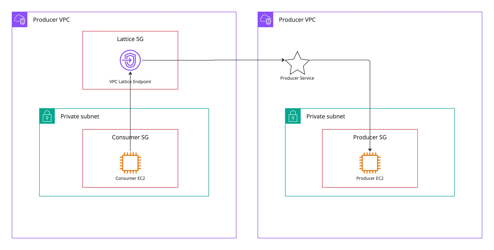

# CDK test app for VPC Lattice

This is an app to test whenever a service producer needs to have an association with the Lattice Network to field requests from the service network.

This app deploys:
- 2 default vpc with(!) NAT Gateways (!)
- 2 Ec2, 1 in each VPC
- 3 Security groups
- 1 Lattice Service Network
- 1 Lattice VPC Association
- 1 Lattice Service
- 1 Lattice Service Association

## Conclusion

A producer does not need to be in a VPC that has an association with the service network to field requests for the serice to function.

## Notes

If you wish to use least-privileged networking, you need to define an ingress rule that has a prefix-list as its source. As of writing this, [cdk does not support prefix lookup](https://github.com/aws/aws-cdk/issues/15115). If you are logged in, find yours [here](https://eu-west-1.console.aws.amazon.com/vpcconsole/home?region=eu-west-1#ManagedPrefixLists:v=3;search=:vpc-lattice). Update [this line accordingly](https://github.com/Scribbd/aws-latice-cdk/blob/main/servicenettest/servicenettest_stack.py#L30).